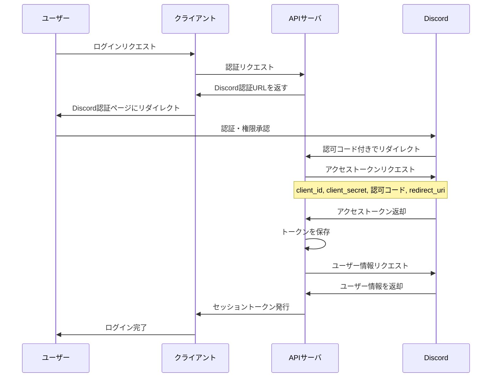

import Mermaid from "@theme/Mermaid";

# 認証 API

このページでは、アプリケーションの認証フローについて説明します。認証プロセスは Discord を利用して行われ、成功するとセッショントークンが発行されます。

## 認証フロー

以下のシーケンス図は、ユーザーがアプリケーションにログインする際の認証フローを示しています。

## 認証プロセスの詳細

1. **ログイン開始**: ユーザーがアプリケーションのログインボタンをクリックします
2. **認証リクエスト**: クライアントが API サーバーに認証リクエストを送信します
3. **Discord 認証**: API サーバーは Discord 認証 URL を返し、ユーザーは Discord の認証ページにリダイレクトされます
4. **権限承認**: ユーザーが Discord で認証し、アプリケーションに必要な権限を承認します
5. **認可コード**: Discord は認可コードを付けて API サーバーにリダイレクトします
6. **アクセストークン取得**: API サーバーは認可コードを使用して Discord からアクセストークンを取得します
7. **ユーザー情報取得**: API サーバーはアクセストークンを使用して Discord からユーザー情報を取得します
8. **セッショントークン発行**: API サーバーはセッショントークンを発行し、クライアントに返します
9. **ログイン完了**: クライアントはセッショントークンを保存し、ユーザーのログインが完了します
